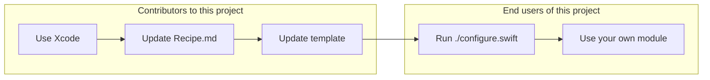

# Swift 6 Module Template

Recipe: [](https://github.com/fulldecent/swift6-module-template/actions/workflows/ci.yml)

Generated project: [](https://github.com/fulldecent/swift6-module-template/actions/workflows/swiftlang-workflows.yml)

Use this template as a starting point for any Swift 6 module that you want other people to include in their projects.

:white_check_mark: STATUS: This template is ready and works in production code. See [releases](https://github.com/fulldecent/swift6-module-template/releases) to confirm we support the latest Xcode version.


## Features

Your new Swift module will immediately have working, compilable code, and implement these best practices:

- Ability to be used from Swift Package Manager
- Clean folder structure
- MIT license
- Testing as a standard
- Turnkey access to GitHub Actions testing recommended by the Swift project
- Semantic versioning and a CHANGELOG
- Included example/demo app using SwiftUI
- Use a Xcode project to manage your code

## How to use this

Clone or [download a release](https://github.com/fulldecent/swift6-module-template/releases) and run the  `./configure.swift` program. It will ask you some questions and generate a project.

You then add all the interesting features you want your module to have.

### Automating the configure script

To skip interactive prompts in the `./configure.swift` script, use these environment variables:

| Template variable                | Environment variable                     |
| -------------------------------- | ---------------------------------------- |
| `__PROJECT_NAME__`               | `SMT_PROJECT_NAME`                       |
| `__ORGANIZATION NAME__`          | `SMT_ORGANIZATION_NAME`                  |
| `com.AN.ORGANIZATION.IDENTIFIER` | `SMT_COM_AN_ORGANIZATION_IDENTIFIER`     |
| `__AUTHOR NAME__`                | `SMT_AUTHOR_NAME`                        |
| `__TODAYS_DATE__`                | `SMT_TODAYS_DATE`                        |
| `__TODAYS_YEAR__`                | `SMT_TODAYS_YEAR`                        |
| `__GITHUB_USERNAME__`            | `SMT_GITHUB_USERNAME`                    |

For example, you may use: `export SMT_ORGANIZATION_NAME='Awesome Org'` before running `./configure.swift`.

## How it works



## Deployment test

After updating the recipe and template xxPROJECTxNAMExx, also validate the GitHub Actions template for the inside project.

:information_source: This process is a workaround for a GitHub Actions system restriction that prevents one GitHub Action (the one for this template repository) from editing and kicking off another GitHub Action (the one inside the new xxPROJECTxNAMExx to test.

```sh
git clone git@github.com:fulldecent/swift6-module-template.git ~/Desktop/swift6-module-template
cd ~/Desktop/swift6-module-template
export SMT_XXPROJECTXNAMEXX="TestModule"
export SMT_ORGANIZATION_NAME="Test Organization"
export SMT_COM_AN_ORGANIZATION_IDENTIFIER="com.test.organization"
export SMT_AUTHOR_NAME="Test Author"
export SMT_TODAYS_DATE="January 1, 2024"
export SMT_TODAYS_YEAR="2024"
export SMT_GITHUB_USERNAME="testuser"
./configure.swift
# ℹ️ Now OUTPUT/TestModule is is a complete project you could publish
cp -r OUTPUT/TestModule ~/Desktop/swift6-module-template-production-test
cd ~/Desktop/swift6-module-template-production-test
git init
git remote add origin git@github.com:fulldecent/swift6-module-template.git
git add .
git commit -m "Initial commit for production-test branch with TestModule contents"
git push --force origin HEAD:production-test
```

## Contributing

See the file [Recipe.md](Recipe.md) for the complete steps (e.g. Open Xcode, make new project, click here, type that, …) of how we made the template.
