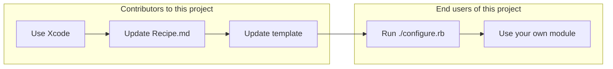

# Swift 6 Module Template

Use this template as a starting point for any Swift 6 module that you want other people to include in their projects.

**STATUS: This template is ready and works in production code, compatible with Xcode Version 16.0 (16A242d)**

## Features

Your new Swift module will immediately have working, compilable code, and implement these best practices:

-   Ability to be used from Swift Package Manager
-   Clean folder structure
-   MIT license
-   Testing as a standard
-   Turnkey access to GitHub Actions testing
-   Semantic versioning and a CHANGELOG
-   Included example/demo app using SwiftUI
-   Use a Xcode project to manage your code

## How to use this

Clone or [download a release](https://github.com/fulldecent/swift5-module-template/releases) and run the  `./configure.rb` program. It will ask you some questions and generate a project.

You then add all the interesting features you want your module to have.

### Automating the configure script

To skip interactive prompts in the `./configure` script, use these environment variables:

| Template variable                | Environment variable                     |
| -------------------------------- | ---------------------------------------- |
| `__PROJECT_NAME__`               | `SMT_PROJECT_NAME`                       |
| `__ORGANIZATION NAME__`          | `SMT_ORGANIZATION_NAME`                  |
| `com.AN.ORGANIZATION.IDENTIFIER` | `SMT_COM_AN_ORGANIZATION_IDENTIFIER`     |
| `__AUTHOR NAME__`                | `SMT_AUTHOR_NAME`                        |
| `__TODAYS_DATE__`                | `SMT_TODAYS_DATE`                        |
| `__TODAYS_DATE__` (date format)  | `SMT_DATE_FORMAT_STRING` Note: this will ask you for today’s date but it will use this format in the template. |
| `__TODAYS_YEAR__`                | `SMT_TODAYS_YEAR`                        |
| `__GITHUB_USERNAME__`            | `SMT_GITHUB_USERNAME`                    |

For example, you may use: `export SMT_ORGANIZATION_NAME='Awesome Org'` before running `./configure`.

## How it works

## Contributing

See the file [Recipe.md](Recipe.md) for the complete steps (e.g. Open Xcode, make new project, click here, type that, …) of how we made the template.

