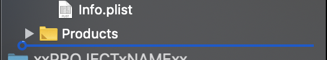

# Recipe

This recipe documents exactly how we created the Swift 5 Module Template. Please follow along and you should create a template that is identical to the one we provided. If this recipe is not perfect (or your result is different from our template in any way) then please submit an issue or pull request.


## Ingredients

During the steps of this recipe we enter specific values where needed. These are chosen carefully so that they can be found and replaced in the template to create your project.

Some variables have spaces in them. That is intentional because it causes Xcode to use double quotes around them in its project configuration files.

-   `xxPROJECTxNAMExx`
    -   This must be a valid C99 extended identifier (otherwise the Xcode check dependencies step fails). It cannot contain spaces.
    -   This must also be a Uniform Target Identifier (/^[a-zA-Z0-9-.]+$/).
    -   If this contains the characters `-` or `.` then they will be transliterated to `_` for file names.

-   `__ORGANIZATION NAME__`

    -   This intentionally has a space which causes Xcode to use double quotes in its project configuration files.

-   `com.AN.ORGANIZATION.IDENTIFIER`

-   `__AUTHOR NAME__`

    -   This intentionally has a space which causes Xcode to use double quotes in its project configuration files.

-   `__TODAYS_DATE__`

-   `__TODAYS_YEAR__`

-   `__GITHUB_USERNAME__`


## Steps

Complete all these instructions on the same calendar day.

Use Xcode Version 11.1 (11A1027). *This is the latest publicly released or Gold Master version.*

### I. Create a package for your module

1. In Xcode, choose File > New > Swift Package…
   1. Navigate to your Desktop folder
   2. Type the name `xxPROJECTxNAMExx`
   3. Click “Create"


### II. Add some functionality to the module

1. Use Terminal.app to insert some files into the project

   ```sh
   cd ~/Desktop/xxPROJECTxNAMExx/Sources/xxPROJECTxNAMExx/
   curl 'https://raw.githubusercontent.com/fulldecent/swift5-module-template/master/xxPROJECTxNAMExx/Sources/xxPROJECTxNAMExx/xxPROJECTxNAMExx.swift' -o xxPROJECTxNAMExx.swift
   curl 'https://raw.githubusercontent.com/fulldecent/swift5-module-template/master/xxPROJECTxNAMExx/Sources/xxPROJECTxNAMExx/White King.swift' -o White\ King.swift
   ```

### III. Create a Swift project for your iOS Example application

1. In Xcode, choose File > New > Project…
   1. *Choose a template*
      1. Click "iOS" then "Single View App"

      2. Click "Next"

   2. *Set the project options*
      1. Set Product Name to "iOS Example"
      2. Set Organization Name to `__ORGANIZATION NAME__`
      3. Set Organization Identifier to `com.AN.ORGANIZATION.IDENTIFIER`
      4. Set Language to "Swift"
      5. Set User Interface to "Storyboard"
      6. Ensure "Include Unit Tests" is not selected
      7. Ensure "Include UI Tests" is not selected
      8. Click “Next"
   3. *Create the project*
      1. Ensure “Create Git Repository" is not selected
      2. Ensure add to is “Don’t add to any project or workspace"
      3. Select the folder `xxPROJECTxNAMExx` on the desktop
      4. Click “Create"

### IV. Use the directory layout structure like Alamofire

1. *Move iOS Example source code to a folder named "Sources"*
   1. Open the file iOS Example.xcodeproj in Xcode
   2. Enable the Project navigator on the left
   3. Use the Project navigator to select the "iOS Example" folder (yellow icon)
   4. From the Project navigator, rename this folder to "Sources"
      * :warning: Using the File inspector to rename a folder would result in the change being reverted. This is an Xcode bug that we work around.
      * :information_source: The Alamofire project uses the folder name "Source" but we choose "Sources" here to be consistent with the default of Swift Package Manager
2. *Fix the Info.plist file configuration and preview content folder (Xcode makes renaming folders a pain)*
   1. Click "iOS Example" on the left (the blue icon)
   2. Click the target "iOS Example" in the middle (app icon)
   3. Click Build Settings on the top of the middle
   4. Enter "/Info" in the search box
   5. Edit the "Info.plist File" from "iOS Example/Info.plist" to be "Sources/Info.plist"

### V. Add some functionality to your iOS Example application

1. Use Terminal.app to insert some files into the project

   ```sh
   cd ~/Desktop/xxPROJECTxNAMExx/iOS\ Example/Sources
   curl 'https://raw.githubusercontent.com/fulldecent/swift5-module-template/master/xxPROJECTxNAMExx/iOS Example/Sources/Base.lproj/Main.storyboard' -o Base.lproj/Main.storyboard
   ```

### VI. Make your iOS Example application depend on your module

1. Close everything that is open in Xcode

   - ⚠️ This is a workaround an Xcode bug where adding a Swift package to a workspace, when that Swift package is open in a separate window, will improperly load the package as ".." instead of the correct package name.

2. Open iOS Example.xcodeproj in Xcode

3. Drag the `xxPROJECTxNAMExx` folder on your desktop into the Xcode Project navigator at the bottom, be sure it is subordinated under iOS Example
   :x:: 

   :white_check_mark:: 

   1. At the dialog "Do you want to save this project in a new workspace?" click "Save"
   2. Navigate inside the iOS Example folder, in the `xxPROJECTxNAMExx` folder on your desktop
   3. Set the name as "iOS Example.xcworkspace"
   4. Click Save
      - ⚠️ Xcode will also show the iOS Example folder inside the `xxPROJECTxNAMExx` module. Swift packages are unable to specify excluded files. You can safely ignore that folder.

4. *Add a build dependency*

   1. Click "iOS Example" on the left (the blue icon)
   2. Click the target "iOS Example" in the middle (app icon)
   3. Click Build Phases on the top of the middle
   4. Open the section Link Binary With Libraries
   5. Click the plus (+) button
   6. Select xxPROJECTxNAMExx (the building icon)

### VII. Add additional project management files to the module

These files represent best practices which every Swift module author should adopt for published code.

1. Use Terminal.app to add additional files to the project

2. ```sh
  cd ~/Desktop/xxPROJECTxNAMExx/
  curl 'https://raw.githubusercontent.com/github/gitignore/master/Swift.gitignore' -o .gitignore
  curl 'https://raw.githubusercontent.com/fulldecent/swift5-module-template/master/xxPROJECTxNAMExx/.travis.yml' -o .travis.yml
  curl 'https://raw.githubusercontent.com/fulldecent/swift5-module-template/master/xxPROJECTxNAMExx/LICENSE' -o LICENSE
  curl 'https://raw.githubusercontent.com/fulldecent/swift5-module-template/master/xxPROJECTxNAMExx/README.md' -o README.md
  curl 'https://raw.githubusercontent.com/fulldecent/swift5-module-template/master/xxPROJECTxNAMExx/CHANGELOG.md' -o CHANGELOG.md
  curl 'https://raw.githubusercontent.com/fulldecent/swift5-module-template/master/xxPROJECTxNAMExx/CONTRIBUTING.md' -o CONTRIBUTING.md
  echo 'xxPROJECTxNAMExx.framework.zip' >> .gitignore
  curl 'https://raw.githubusercontent.com/fulldecent/swift5-module-template/master/xxPROJECTxNAMExx/Tests/CheckCocoaPodsQualityIndexes.rb' -o Tests/CheckCocoaPodsQualityIndexes.rb
  ```

### VIII. Remove identifying parts of your project

This step allows everybody to achieve byte-for-byte consistency with the published Swift 5 Module Template but otherwise provides no value to you.

1. Use Terminal.app to find and replace all occurrences of hard-coded strings with template variables

   ```sh
   find -E ~/Desktop/xxPROJECTxNAMExx \
     -regex '.*\.(h|swift)' -exec sed -i '' -E -e '
       s-(// +Created by ).*( on ).*\.-\1__AUTHOR NAME__\2__TODAYS_DATE__.-
       s-(// +Copyright © ).*-\1__TODAYS_YEAR__ __ORGANIZATION NAME__. All rights reserved.-' \
       '{}' \;
   ```

2. Use Terminal.app to remove all references to development team IDs

   ```sh
   find ~/Desktop/xxPROJECTxNAMExx -name project.pbxproj \
     -exec sed -i '' -E -e '/DevelopmentTeam = /d
       s/(DEVELOPMENT_TEAM = )[^;]+/\1""/' '{}' \;
   ```

## Taste testing

1. Open `xxPROJECTxNAMExx`.xcworkspace

2. Use the scheme navigator to select iOS Example and the latest iPhone version

3. Choose Product > Run

   * :white_check_mark: You should see a big white king (♔). That means it worked!

4.  *Compare with the distributed Swift 5 Module Template repository*

    1.  Clone the repository to your desktop use Terminal

        ```sh
        git clone https://github.com/fulldecent/swift5-module-template.git ~/Desktop/swift5-module-template
        ```

    2.  Compare the distributed version with your version

        ```sh
        cd ~/Desktop/swift5-module-template
        rm -rf xxPROJECTxNAMExx
        cp -r ~/Desktop/xxPROJECTxNAMExx .
        git diff
        ```

        * :white_check_mark: You should see an empty screen (press <kbd>q</kbd> to close)
        * :mega: If you see differences, please raise an issue in the project repository
